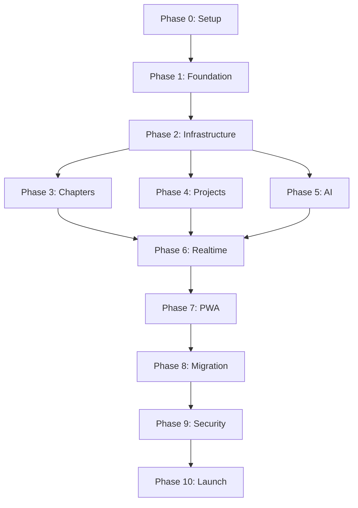

# Writegeist Web Migration — Master Task List

**Complete dependency-ordered execution plan for migrating Writegeist from Electron Desktop to cloud-native web application.**

Based on: `WRITEGEIST_WEB_MIGRATION_GUIDE.md`  
Target: Next.js + Supabase + FastAPI on Railway, deployed on Vercel  
Timeline: 6-8 weeks (160 hours)

## Conventions & Rules

- **Shell**: PowerShell commands (no chained `&&` operators) [[memory:3010554]]
- **Environment**: Use root `.env` file for all configuration [[memory:3055196]]
- **Validation**: Each task includes verification checks [[memory:3010551]]
- **Dependencies**: Tasks ordered by technical dependencies
- **Roles**: FE (Frontend), BE (Backend), DevOps (Infrastructure), QA (Testing)

---

## Phase 0 — Project Setup & Access (Pre-work)

### T0.1 Project Approval & Resource Allocation
**Dependencies**: None  
**Owner**: PM  
**Effort**: 4 hours

**Steps**:
- [ ] Secure 6-8 week migration window approval
- [ ] Allocate engineering resources (1 FE, 1 BE, 0.5 DevOps)
- [ ] Approve budget for cloud services ($50-150/month)
- [ ] Create project timeline and milestone checkpoints

**Verification**:
- [ ] Written approval document exists
- [ ] Calendar blocks reserved for team
- [ ] Budget approved in expense system

**Deliverables**:
- Migration kickoff document
- Resource allocation plan
- Budget approval

### T0.2 Cloud Service Account Setup
**Dependencies**: T0.1  
**Owner**: DevOps  
**Effort**: 2 hours

**Steps**:
- [ ] Create organization accounts: Vercel, Supabase, Railway, OpenAI
- [ ] Add team members with appropriate permissions
- [ ] Configure billing and usage alerts
- [ ] Document access credentials securely

**Verification**:
- [ ] Each team member can log into all services
- [ ] Billing configured with alerts at 80% budget
- [ ] Access documented in team password manager

**Deliverables**:
- Service account roster
- Access documentation
- Billing configuration

### T0.3 Repository & Version Control Setup
**Dependencies**: T0.1  
**Owner**: DevOps  
**Effort**: 1 hour

**Steps**:
- [ ] Create new repository `writegeist-web`
- [ ] Configure branch protection rules (main, develop)
- [ ] Set up CODEOWNERS file
- [ ] Configure GitHub Actions permissions

**Verification**:
- [ ] Repository accessible to all team members
- [ ] Branch protection prevents direct pushes to main
- [ ] Actions can read/write as needed

**Deliverables**:
- Protected repository
- Branch strategy documentation

---

## Phase 1 — Foundation Setup (Week 1-2)

### T1.1 Next.js Project Initialization
**Dependencies**: T0.3  
**Owner**: FE  
**Effort**: 2 hours

**Steps**:
```powershell
npx create-next-app@latest writegeist-web --typescript --tailwind --app
cd writegeist-web
npm install
```

**Verification**:
- [ ] `npm run dev` starts successfully at http://localhost:3000
- [ ] TypeScript compilation passes
- [ ] Tailwind CSS classes render correctly

**Deliverables**:
- Baseline Next.js 14 application
- Initial commit to repository

### T1.2 Development Environment Configuration
**Dependencies**: T1.1  
**Owner**: FE  
**Effort**: 3 hours

**Steps**:
- [ ] Configure `tsconfig.json` with path aliases (`@/*` → `./`)
- [ ] Add ESLint with `eslint-config-next`
- [ ] Configure Prettier with consistent formatting
- [ ] Add `.editorconfig` for consistent line endings
- [ ] Set up development scripts in `package.json`

**Verification**:
- [ ] `npm run lint` passes without errors
- [ ] `npm run format` produces no changes on clean code
- [ ] Path aliases resolve correctly in IDE

**Deliverables**:
- `tsconfig.json` with path aliases
- `.eslintrc.js` configuration
- `.prettierrc` configuration
- `.editorconfig` file

### T1.3 UI Component Migration
**Dependencies**: T1.2  
**Owner**: FE  
**Effort**: 8 hours

**Steps**:
- [ ] Copy from desktop repo using PowerShell:
  ```powershell
  # Copy reusable assets
  Copy-Item -Recurse writegeist-desktop/src/components/ui writegeist-web/components/
  Copy-Item -Recurse writegeist-desktop/src/renderer/features writegeist-web/components/features/
  Copy-Item -Recurse writegeist-desktop/src/hooks writegeist-web/hooks/
  Copy-Item -Recurse writegeist-desktop/src/lib writegeist-web/lib/
  Copy-Item -Recurse writegeist-desktop/src/types writegeist-web/types/
  
  # Copy configuration files
  Copy-Item writegeist-desktop/tailwind.config.js writegeist-web/
  Copy-Item writegeist-desktop/components.json writegeist-web/
  Copy-Item writegeist-desktop/tsconfig.json writegeist-web/ # Adapt for Next.js
  ```
- [ ] Update all imports to use Next.js path aliases (`@/`)
- [ ] Remove Electron-specific code (`window.api`, `ipcRenderer`)
- [ ] Replace `react-router-dom` with Next.js routing
- [ ] Fix TypeScript compilation errors

**Verification**:
- [ ] `npm run build` completes successfully
- [ ] No TypeScript errors in migrated components
- [ ] No references to `window.api` or Electron APIs
- [ ] All imports use `@/` path aliases

**Deliverables**:
- Migrated UI component library
- Updated import statements
- Clean TypeScript compilation

### T1.4 Electron Code Removal & API Stubs
**Dependencies**: T1.3  
**Owner**: FE  
**Effort**: 4 hours

**Steps**:
- [ ] Replace all IPC calls with HTTP API client methods (stub implementations)
- [ ] Remove file system direct access code
- [ ] Create API client interface matching existing IPC methods
- [ ] Add temporary mock responses for development

**Verification**:
- [ ] No global `window.api` references remain
- [ ] All components render without runtime errors
- [ ] Mock API responses allow UI development

**Deliverables**:
- API client interface
- Stubbed HTTP methods
- Electron-free component code

### T1.5 App Router Structure
**Dependencies**: T1.3  
**Owner**: FE  
**Effort**: 4 hours

**Steps**:
- [ ] Create route structure under `app/`:
  - `(auth)/login/page.tsx`
  - `(auth)/signup/page.tsx`
  - `project/page.tsx`
  - `chapters/page.tsx`
  - `ingest/page.tsx`
  - `ideas/page.tsx`
  - `chat/page.tsx`
  - `audio/page.tsx`
  - `settings/page.tsx`
- [ ] Create shared layout: `app/layout.tsx`
- [ ] Add navigation components (header, sidebar)

**Verification**:
- [ ] All routes render with placeholder content
- [ ] Navigation between routes works
- [ ] Layout persists across route changes

**Deliverables**:
- Complete route structure
- Shared layout components
- Navigation system

### T1.6 Environment Configuration
**Dependencies**: T1.1  
**Owner**: FE/DevOps  
**Effort**: 2 hours

**Steps**:
- [ ] Create `.env.example` with all required variables
- [ ] Create `.env.local` for development
- [ ] Configure environment variables:
  - `NEXT_PUBLIC_SUPABASE_URL`
  - `NEXT_PUBLIC_SUPABASE_ANON_KEY`
  - `SUPABASE_SERVICE_ROLE_KEY` (server-side only)
  - `OPENAI_API_KEY`
  - `BACKEND_API_URL` (Railway FastAPI endpoint)
  - `DATABASE_URL` (if direct PostgreSQL access needed)
- [ ] Update all code to read from root `.env` [[memory:3055196]]
- [ ] Add `.env.local` to `.gitignore`

**Verification**:
- [ ] `process.env` variables accessible in Next.js
- [ ] No undefined environment variables during build
- [ ] `.env.local` in `.gitignore`
- [ ] Server-side env vars not exposed to client

**Deliverables**:
- `.env.example` documentation
- Environment variable configuration
- Secrets management strategy

### T1.7 Supabase Project Setup
**Dependencies**: T0.2, T1.6  
**Owner**: DevOps  
**Effort**: 3 hours

**Steps**:
```powershell
npm install -g supabase
supabase init
supabase start
```
- [ ] Create Supabase project in dashboard
- [ ] Configure local development environment
- [ ] Set up database connection
- [ ] Configure authentication providers

**Verification**:
- [ ] Supabase Studio opens at http://localhost:54323
- [ ] Database connection successful
- [ ] Authentication service running

**Deliverables**:
- Supabase project configuration
- Local development setup
- Database connection

### T1.8 Authentication Scaffolding
**Dependencies**: T1.5, T1.7  
**Owner**: FE  
**Effort**: 6 hours

**Steps**:
- [ ] Install Supabase packages:
  - `@supabase/supabase-js`
  - `@supabase/auth-helpers-nextjs`
- [ ] Create `lib/supabase/client.ts`
- [ ] Create `lib/supabase/auth.ts` with auth methods
- [ ] Build login/signup pages
- [ ] Add authentication middleware

**Verification**:
- [ ] User can sign up successfully
- [ ] User can sign in successfully
- [ ] User records appear in Supabase dashboard
- [ ] Protected routes redirect unauthenticated users

**Deliverables**:
- Supabase client configuration
- Authentication pages
- Auth middleware

---

## Phase 2 — Core Infrastructure (Week 2-3)

### T2.1 Database Schema Migration
**Dependencies**: T1.7  
**Owner**: DevOps/BE  
**Effort**: 4 hours

**Steps**:
- [ ] Create migration file: `supabase migration new initial_schema`
- [ ] Define tables with exact schema from desktop:
  ```sql
  -- Projects table
  CREATE TABLE projects (
    id TEXT PRIMARY KEY,
    user_id UUID REFERENCES auth.users(id) ON DELETE CASCADE,
    name TEXT NOT NULL,
    created_at TIMESTAMP WITH TIME ZONE DEFAULT NOW()
  );

  -- Chapters table (matching desktop schema)
  CREATE TABLE chapters (
    id TEXT PRIMARY KEY,
    user_id UUID REFERENCES auth.users(id) ON DELETE CASCADE,
    title TEXT NOT NULL,
    text TEXT NOT NULL,
    characters JSONB NOT NULL DEFAULT '[]',
    locations JSONB NOT NULL DEFAULT '[]',
    pov JSONB NOT NULL DEFAULT '[]',
    "order" INTEGER DEFAULT 0,
    created_at TIMESTAMP WITH TIME ZONE DEFAULT NOW()
  );

  -- Project pages table
  CREATE TABLE project_pages (
    id SERIAL PRIMARY KEY,
    user_id UUID REFERENCES auth.users(id) ON DELETE CASCADE,
    markdown TEXT NOT NULL,
    updated_at TIMESTAMP WITH TIME ZONE DEFAULT NOW()
  );

  -- Chapter audio table
  CREATE TABLE chapter_audio (
    id TEXT PRIMARY KEY,
    user_id UUID REFERENCES auth.users(id) ON DELETE CASCADE,
    chapter_id TEXT NOT NULL,
    audio_url TEXT,
    duration INTEGER,
    status TEXT DEFAULT 'pending',
    created_at TIMESTAMP WITH TIME ZONE DEFAULT NOW(),
    updated_at TIMESTAMP WITH TIME ZONE DEFAULT NOW()
  );
  ```
- [ ] Enable Row Level Security (RLS) on all tables
- [ ] Create RLS policies for user data isolation
- [ ] Apply migration: `supabase db push`

**Verification**:
- [ ] All tables created successfully
- [ ] RLS policies prevent cross-user data access
- [ ] Can insert/select data for authenticated user
- [ ] JSONB columns handle arrays correctly

**Deliverables**:
- `supabase/migrations/*_initial_schema.sql`
- Database schema documentation
- RLS policy configuration

### T2.2 Storage Configuration
**Dependencies**: T2.1  
**Owner**: DevOps  
**Effort**: 2 hours

**Steps**:
- [ ] Create storage bucket: `chapter-audio`
- [ ] Configure bucket policies for user access
- [ ] Set up public URL generation
- [ ] Configure file upload limits and types

**Verification**:
- [ ] File upload succeeds for authenticated user
- [ ] `getPublicUrl()` returns accessible URL
- [ ] Unauthorized users cannot access other users' files

**Deliverables**:
- Storage bucket configuration
- Access policies
- Upload/download utilities

### T2.3 API Client Implementation
**Dependencies**: T2.1, T1.6  
**Owner**: FE  
**Effort**: 6 hours

**Steps**:
- [ ] Implement `lib/api/client.ts` with Supabase wrapper
- [ ] Create typed API modules:
  - `lib/api/chapters.ts`
  - `lib/api/projects.ts`
  - `lib/api/audio.ts`
  - `lib/api/ai.ts` (stub)
- [ ] Add error handling and retry logic
- [ ] Implement optimistic updates

**Verification**:
- [ ] CRUD operations work for all entities
- [ ] Error handling displays user-friendly messages
- [ ] TypeScript types enforce correct usage

**Deliverables**:
- Complete API client library
- Typed method interfaces
- Error handling system

### T2.4 User Settings & Preferences
**Dependencies**: T1.8, T2.1  
**Owner**: FE  
**Effort**: 3 hours

**Steps**:
- [ ] Create settings page UI
- [ ] Implement user preferences storage
- [ ] Add API key management (encrypted)
- [ ] Configure theme and editor preferences

**Verification**:
- [ ] Settings persist across sessions
- [ ] API keys stored securely
- [ ] Preferences apply to UI immediately

**Deliverables**:
- Settings page
- Preferences system
- Secure API key storage

---

## Phase 3 — Chapter Management (Week 3-4)

### T3.1 Chapter Editor Migration
**Dependencies**: T1.3, T2.3  
**Owner**: FE  
**Effort**: 8 hours

**Steps**:
- [ ] Migrate `ChapterEditor` component
- [ ] Replace IPC calls with `chaptersAPI.save()`
- [ ] Implement debounced auto-save
- [ ] Add optimistic UI updates
- [ ] Handle save conflicts gracefully

**Verification**:
- [ ] Chapter creation persists to database
- [ ] Chapter editing updates correctly
- [ ] Auto-save works without user intervention
- [ ] Page reload shows latest changes

**Deliverables**:
- Functional chapter editor
- Auto-save mechanism
- Conflict resolution

### T3.2 Chapter List & Drag-Drop
**Dependencies**: T2.3  
**Owner**: FE  
**Effort**: 6 hours

**Steps**:
- [ ] Create chapter list component
- [ ] Implement drag-drop with `@dnd-kit`
- [ ] Add reorder functionality with database persistence
- [ ] Optimize for large chapter lists

**Verification**:
- [ ] Chapters display in correct order
- [ ] Drag-drop reordering persists
- [ ] Order maintained across page refreshes
- [ ] Performance acceptable with 100+ chapters

**Deliverables**:
- Chapter list component
- Drag-drop reordering
- Order persistence

### T3.3 Draft Recovery System
**Dependencies**: T3.1  
**Owner**: FE  
**Effort**: 4 hours

**Steps**:
- [ ] Implement IndexedDB storage for drafts
- [ ] Add periodic draft saves during editing
- [ ] Create recovery prompt on editor load
- [ ] Handle draft cleanup after successful save

**Verification**:
- [ ] Unsaved changes survive browser crash
- [ ] Recovery prompt appears with unsaved drafts
- [ ] User can choose to restore or discard drafts

**Deliverables**:
- Draft storage system
- Recovery UI
- Cleanup mechanism

---

## Phase 4 — Project & Content Management (Week 4)

### T4.1 Project Page Migration
**Dependencies**: T1.3, T2.3  
**Owner**: FE  
**Effort**: 8 hours

**Steps**:
- [ ] Migrate project hub editor (TipTap/Novel)
- [ ] Connect to `project_pages` table
- [ ] Implement H2 heading navigation
- [ ] Add markdown preview mode
- [ ] Ensure SSR compatibility

**Verification**:
- [ ] Project editing saves to database
- [ ] Navigation sidebar updates from H2 headings
- [ ] Preview mode renders markdown correctly
- [ ] SSR works without hydration errors

**Deliverables**:
- Project page editor
- Navigation system
- Preview functionality

### T4.2 Character/Location Sync
**Dependencies**: T4.1, T5.2  
**Owner**: FE/BE  
**Effort**: 6 hours

**Steps**:
- [ ] Implement smart markdown insertion logic
- [ ] Create character/location deduplication
- [ ] Add automatic project document updates
- [ ] Handle concurrent edits gracefully

**Verification**:
- [ ] New characters from chapters appear in project
- [ ] No duplicate entries created
- [ ] Updates are idempotent
- [ ] Manual edits preserved

**Deliverables**:
- Sync utility functions
- Deduplication logic
- Integration hooks

### T4.3 Content Synchronization
**Dependencies**: T4.1, T3.1  
**Owner**: FE  
**Effort**: 4 hours

**Steps**:
- [ ] Implement cross-view content updates
- [ ] Add debounced save coalescing
- [ ] Create update notification system
- [ ] Handle offline/online state changes

**Verification**:
- [ ] Changes visible across tabs within 2 seconds
- [ ] No excessive database writes
- [ ] Offline changes sync when online

**Deliverables**:
- Cross-view synchronization
- Save coalescing
- Offline handling

---

## Phase 5 — AI Integration (Week 5-6)

### T5.1 Backend Deployment (Railway)
**Dependencies**: T0.2  
**Owner**: DevOps/BE  
**Effort**: 4 hours

**Steps**:
- [ ] Add `Procfile` to `ai-service/`:
  ```
  web: python -m uvicorn main:app --host 0.0.0.0 --port $PORT
  ```
- [ ] Create `railway.toml` configuration:
  ```toml
  [build]
  builder = "NIXPACKS"

  [deploy]
  startCommand = "python -m uvicorn main:app --host 0.0.0.0 --port $PORT"

  [env]
  OPENAI_API_KEY = { from = "OPENAI_API_KEY" }
  DATABASE_URL = { from = "DATABASE_URL" }
  SUPABASE_URL = { from = "SUPABASE_URL" }
  SUPABASE_ANON_KEY = { from = "SUPABASE_ANON_KEY" }
  ```
- [ ] Configure CORS for Vercel and localhost in FastAPI
- [ ] Set environment variables in Railway dashboard
- [ ] Deploy using PowerShell:
  ```powershell
  railway login
  railway init
  railway up
  ```
- [ ] Remove n8n workflow dependencies (simplify AI pipeline)

**Verification**:
- [ ] Health endpoint returns 200
- [ ] CORS allows frontend requests from Vercel and localhost
- [ ] Environment variables accessible in app
- [ ] Logs streaming correctly in Railway dashboard
- [ ] No n8n dependencies remain

**Deliverables**:
- Live backend URL
- Deployment configuration
- Health monitoring setup

### T5.2 AI Workflow Engine
**Dependencies**: T1.6, T5.1  
**Owner**: BE/FE  
**Effort**: 10 hours

**Steps**:
- [ ] Implement direct OpenAI integration
- [ ] Create chapter analysis pipeline
- [ ] Add idea enhancement functionality
- [ ] Standardize response schemas
- [ ] Add error handling and retries

**Verification**:
- [ ] Chapter analysis returns structured data
- [ ] Idea enhancement produces quality output
- [ ] Error handling graceful for API failures
- [ ] Response times under 10 seconds

**Deliverables**:
- AI workflow engine
- Standardized schemas
- Error handling

### T5.3 Vector Search Implementation
**Dependencies**: T5.1  
**Owner**: BE  
**Effort**: 8 hours

**Steps**:
- [ ] Enable `pgvector` extension in Supabase:
  ```sql
  CREATE EXTENSION IF NOT EXISTS vector;
  ```
- [ ] Create `chapter_embeddings` table:
  ```sql
  CREATE TABLE chapter_embeddings (
    id TEXT PRIMARY KEY,
    user_id UUID REFERENCES auth.users(id) ON DELETE CASCADE,
    chapter_id TEXT REFERENCES chapters(id) ON DELETE CASCADE,
    embedding vector(1536), -- OpenAI ada-002 dimensions
    content_chunk TEXT NOT NULL,
    created_at TIMESTAMP WITH TIME ZONE DEFAULT NOW()
  );
  
  CREATE INDEX ON chapter_embeddings USING ivfflat (embedding vector_cosine_ops);
  ```
- [ ] Implement embedding generation pipeline using OpenAI
- [ ] Add vector similarity search with cosine distance
- [ ] Create query endpoint for story chat

**Verification**:
- [ ] Embeddings generated for sample chapters
- [ ] Search returns relevant results with similarity scores
- [ ] Performance acceptable for 1000+ chapters
- [ ] Results ranked by relevance (cosine similarity)

**Deliverables**:
- Vector database setup
- Embedding generation pipeline
- Similarity search functionality

### T5.4 Story Query Chat
**Dependencies**: T5.3  
**Owner**: FE/BE  
**Effort**: 6 hours

**Steps**:
- [ ] Create chat interface
- [ ] Implement query processing
- [ ] Add context from vector search
- [ ] Create conversational AI responses
- [ ] Add chat history persistence

**Verification**:
- [ ] Chat responds to story questions
- [ ] Responses include relevant chapter context
- [ ] Chat history persists across sessions
- [ ] Response quality meets user expectations

**Deliverables**:
- Chat interface
- Query processing
- Context integration

### T5.5 Audio Generation & Library
**Dependencies**: T2.2, T5.2  
**Owner**: FE/BE  
**Effort**: 8 hours

**Steps**:
- [ ] Implement OpenAI TTS integration
- [ ] Add audio file upload to Supabase Storage
- [ ] Create audio status tracking
- [ ] Build audio library interface
- [ ] Add playback controls

**Verification**:
- [ ] Audio generation completes successfully
- [ ] Files accessible via public URLs
- [ ] Status updates in real-time
- [ ] Playback works across browsers

**Deliverables**:
- Audio generation pipeline
- Storage integration
- Playback interface

---

## Phase 6 — Real-time & Collaboration (Week 7)

### T6.1 Supabase Realtime Setup
**Dependencies**: T2.1, T2.3  
**Owner**: FE  
**Effort**: 4 hours

**Steps**:
- [ ] Configure Supabase Realtime
- [ ] Create realtime channel for chapters
- [ ] Implement change event handling
- [ ] Add component update mechanisms

**Verification**:
- [ ] Changes from one tab appear in another within 1 second
- [ ] No excessive re-renders
- [ ] Connection recovers from network issues

**Deliverables**:
- Realtime provider
- Event handling system
- Connection management

### T6.2 Collaborative Editing Foundation
**Dependencies**: T6.1  
**Owner**: FE  
**Effort**: 6 hours

**Steps**:
- [ ] Implement user presence indicators
- [ ] Add basic conflict detection
- [ ] Create last-writer-wins resolution
- [ ] Add visual conflict warnings

**Verification**:
- [ ] Multiple users see each other's presence
- [ ] Conflicts detected and resolved
- [ ] Users warned about potential conflicts
- [ ] Data integrity maintained

**Deliverables**:
- Presence system
- Conflict resolution
- Warning system

---

## Phase 7 — PWA & Offline Support (Week 8)

### T7.1 PWA Configuration
**Dependencies**: T1.1  
**Owner**: FE  
**Effort**: 4 hours

**Steps**:
- [ ] Install and configure `next-pwa`
- [ ] Create `public/manifest.json`
- [ ] Add PWA icons (192x192, 512x512)
- [ ] Configure service worker
- [ ] Add install prompts

**Verification**:
- [ ] Lighthouse PWA audit passes
- [ ] App installs on mobile devices
- [ ] Service worker caches static assets
- [ ] Install prompt appears appropriately

**Deliverables**:
- PWA configuration
- App manifest
- Service worker

### T7.2 Offline Data Caching
**Dependencies**: T7.1, T3.1  
**Owner**: FE  
**Effort**: 6 hours

**Steps**:
- [ ] Implement IndexedDB caching for chapters:
  ```typescript
  // Service Worker for offline support
  // Cache critical data in IndexedDB
  const cacheChapterOffline = async (chapter: Chapter) => {
    const db = await openDB('writegeist-offline', 1)
    await db.put('chapters', chapter)
  }
  ```
- [ ] Cache recent project documents
- [ ] Add offline read functionality
- [ ] Queue writes for online sync
- [ ] Implement background sync when connection restored

**Verification**:
- [ ] Recent content available offline
- [ ] Offline edits sync when online
- [ ] User notified of offline status
- [ ] No data loss during offline periods
- [ ] Background sync works reliably

**Deliverables**:
- Offline caching system
- Sync queue implementation
- Status indicators and user feedback

---

## Phase 8 — Data Migration & User Onboarding

### T8.1 Desktop Data Migration Script
**Dependencies**: T2.1  
**Owner**: BE  
**Effort**: 8 hours

**Steps**:
- [ ] Create SQLite to PostgreSQL migration script:
  ```typescript
  const migrateUserData = async (sqliteFile: string, userId: string) => {
    const sqlite = new Database(sqliteFile)
    const chapters = sqlite.prepare('SELECT * FROM chapters').all()
    
    for (const chapter of chapters) {
      await supabase.from('chapters').insert({
        ...chapter,
        user_id: userId,
        characters: JSON.parse(chapter.characters),
        locations: JSON.parse(chapter.locations),
        pov: JSON.parse(chapter.pov)
      })
    }
  }
  ```
- [ ] Handle JSON column conversion (parse strings to JSONB)
- [ ] Implement user mapping system (email-based or manual)
- [ ] Add data validation and safety checks
- [ ] Create dry-run mode for testing
- [ ] Handle existing desktop database schema variations

**Verification**:
- [ ] Sample desktop database (`writegeist.db`) migrates successfully
- [ ] Data counts match between source and target
- [ ] RLS policies respected for migrated data
- [ ] No data corruption during migration
- [ ] JSON arrays properly converted to JSONB

**Deliverables**:
- Migration script (`scripts/migrate_sqlite_to_supabase.ts`)
- Validation utilities
- Migration guide for users

### T8.2 User Migration Wizard
**Dependencies**: T8.1  
**Owner**: FE  
**Effort**: 6 hours

**Steps**:
- [ ] Create file upload interface
- [ ] Add migration progress tracking
- [ ] Implement server-side processing
- [ ] Add confirmation and rollback options

**Verification**:
- [ ] Non-technical users can migrate data
- [ ] Progress clearly communicated
- [ ] Errors handled gracefully
- [ ] Rollback works if needed

**Deliverables**:
- Migration wizard UI
- Progress tracking
- Error handling

---

## Phase 9 — Security & Monitoring

### T9.1 Authentication Hardening
**Dependencies**: T1.8  
**Owner**: FE/DevOps  
**Effort**: 4 hours

**Steps**:
- [ ] Add Next.js middleware for route protection
- [ ] Configure secure cookie settings
- [ ] Implement SSR authentication checks
- [ ] Add session timeout handling

**Verification**:
- [ ] Unauthenticated users redirected to login
- [ ] SSR respects authentication state
- [ ] Sessions expire appropriately
- [ ] No authentication bypasses possible

**Deliverables**:
- Authentication middleware
- Security configuration
- Session management

### T9.2 Secrets Management
**Dependencies**: T1.6  
**Owner**: DevOps  
**Effort**: 2 hours

**Steps**:
- [ ] Configure secrets in Vercel
- [ ] Configure secrets in Railway
- [ ] Verify no secrets in code
- [ ] Set up environment separation

**Verification**:
- [ ] Production builds use platform secrets only
- [ ] No secrets in version control
- [ ] Environment separation maintained

**Deliverables**:
- Secrets configuration
- Environment documentation

### T9.3 Error Monitoring
**Dependencies**: None  
**Owner**: FE/BE  
**Effort**: 3 hours

**Steps**:
- [ ] Integrate Sentry or similar service
- [ ] Add error boundaries in React
- [ ] Configure backend error logging
- [ ] Set up alerting thresholds

**Verification**:
- [ ] Errors appear in monitoring dashboard
- [ ] Alerts trigger for critical issues
- [ ] Error context includes useful debugging info

**Deliverables**:
- Error monitoring setup
- Alert configuration
- Debugging tools

---

## Phase 10 — Testing, Performance & Launch

### T10.1 Testing Implementation
**Dependencies**: Baseline app functionality  
**Owner**: QA/FE/BE  
**Effort**: 12 hours

**Steps**:
- [ ] Unit tests for API client and utilities
- [ ] Integration tests for auth and CRUD flows
- [ ] E2E tests with Playwright for critical paths
- [ ] Performance tests for large datasets
- [ ] Accessibility testing

**Verification**:
- [ ] Test coverage above 80% for critical paths
- [ ] All tests pass in CI environment
- [ ] Performance tests meet targets
- [ ] Accessibility audit passes

**Deliverables**:
- Test suite
- Coverage reports
- Performance benchmarks

### T10.2 CI/CD Pipeline
**Dependencies**: T10.1  
**Owner**: DevOps  
**Effort**: 4 hours

**Steps**:
- [ ] Configure Vercel auto-deployment
- [ ] Set up Railway deployment hooks
- [ ] Add database migration automation
- [ ] Configure preview environments

**Verification**:
- [ ] PRs generate preview URLs
- [ ] Main branch deploys to production
- [ ] Database migrations apply safely
- [ ] Rollback procedures work

**Deliverables**:
- CI/CD configuration
- Deployment documentation
- Rollback procedures

### T10.3 Performance Optimization
**Dependencies**: T7.1  
**Owner**: FE  
**Effort**: 6 hours

**Steps**:
- [ ] Optimize bundle size with code splitting and dynamic imports
- [ ] Implement image optimization with Next.js Image component
- [ ] Add performance monitoring (Vercel Analytics, Web Vitals)
- [ ] Implement proper caching strategies (React Query, SWR)
- [ ] Use Supabase edge functions for heavy operations
- [ ] Implement lazy loading for large chapter lists
- [ ] Meet Lighthouse performance budget

**Verification**:
- [ ] Largest Contentful Paint < 2 seconds
- [ ] First Input Delay < 100ms
- [ ] Cumulative Layout Shift < 0.1
- [ ] Bundle size under target limits
- [ ] Time to Interactive < 3 seconds
- [ ] Performance score > 90 in Lighthouse

**Deliverables**:
- Performance optimizations
- Monitoring setup and dashboards
- Performance budget documentation

### T10.4 Production Launch
**Dependencies**: All previous tasks  
**Owner**: PM/DevOps  
**Effort**: 4 hours

**Steps**:
- [ ] Complete UAT checklist with all success metrics
- [ ] Finalize user documentation and migration guides
- [ ] Configure production DNS (custom domain)
- [ ] Execute go-live plan with rollback procedures
- [ ] Monitor post-launch metrics and user feedback
- [ ] Communicate launch to existing desktop users
- [ ] Provide migration assistance and support

**Verification**:
- [ ] All UAT criteria met (100% feature parity)
- [ ] Production smoke tests pass
- [ ] DNS resolves correctly with HTTPS
- [ ] No critical errors in first 24 hours
- [ ] User migration success rate >95%
- [ ] Performance metrics within targets

**Deliverables**:
- Live production application
- User documentation and migration guides
- Launch communication plan
- Support procedures
- Launch retrospective

---

## Success Metrics

### Technical Metrics
- [ ] 100% feature parity with desktop app
- [ ] Page load times < 2 seconds
- [ ] 99.9% uptime target
- [ ] Mobile responsive on all screen sizes
- [ ] Offline functionality for core features
- [ ] Real-time sync latency < 1 second

### User Experience Metrics
- [ ] User migration success rate > 95%
- [ ] User satisfaction score > 4.5/5
- [ ] Support ticket reduction > 50%
- [ ] User onboarding completion > 90%

### Business Metrics
- [ ] Infrastructure cost reduction 70-85%
- [ ] Development velocity increase 2x
- [ ] Cross-platform user growth > 25%
- [ ] Feature release frequency increase 3x

---

## Risk Mitigation

### High-Risk Items
1. **Data Migration Complexity** - Mitigate with extensive testing and rollback procedures
2. **Performance Degradation** - Mitigate with performance budgets and monitoring
3. **User Adoption Resistance** - Mitigate with seamless migration tools and training

### Contingency Plans
- **Technical Issues**: Maintain desktop app in parallel for 30 days
- **Performance Issues**: Implement progressive enhancement and fallbacks
- **User Issues**: Provide migration assistance and extended support

---

## Dependencies Summary



---

## Bill of Materials

### Core Dependencies

#### Remove (Electron-specific)
```json
{
  "devDependencies": {
    "@electron-forge/*": "REMOVE - Electron build tools",
    "electron": "REMOVE - Desktop runtime", 
    "@vercel/webpack-asset-relocator-loader": "REMOVE - Electron webpack",
    "fork-ts-checker-webpack-plugin": "REMOVE - Custom webpack",
    "node-loader": "REMOVE - Electron webpack",
    "ts-loader": "REMOVE - Custom webpack"
  },
  "dependencies": {
    "better-sqlite3": "REMOVE - Local database",
    "electron-squirrel-startup": "REMOVE - Electron installer"
  }
}
```

#### Add (Web-specific)
```json
{
  "devDependencies": {
    "next": "^14.0.0",
    "@types/node": "^20.0.0", 
    "eslint-config-next": "^14.0.0"
  },
  "dependencies": {
    "@supabase/supabase-js": "^2.38.0",
    "@supabase/auth-helpers-nextjs": "^0.8.0",
    "@supabase/auth-helpers-react": "^0.4.0",
    "next-themes": "^0.2.1",
    "socket.io-client": "^4.7.0"
  }
}
```

#### Keep (Universal)
```json
{
  "dependencies": {
    "react": "✅ Keep - UI framework",
    "react-dom": "✅ Keep - DOM rendering", 
    "react-router-dom": "⚠️ Replace with Next.js routing",
    "@dnd-kit/core": "✅ Keep - Drag & drop",
    "@radix-ui/*": "✅ Keep - UI primitives",
    "tailwindcss": "✅ Keep - Styling",
    "lucide-react": "✅ Keep - Icons", 
    "@tiptap/*": "✅ Keep - Rich text editor",
    "clsx": "✅ Keep - CSS utilities",
    "lodash.debounce": "✅ Keep - Utilities"
  }
}
```

### Infrastructure
- **Frontend Hosting**: Vercel
- **Backend Hosting**: Railway (FastAPI)
- **Database**: Supabase PostgreSQL
- **Storage**: Supabase Storage
- **CDN**: Vercel Edge Network
- **Monitoring**: Vercel Analytics, Railway Metrics

---

*This task list represents 160 hours of engineering work across 6-8 weeks, with built-in verification steps and risk mitigation strategies.*
